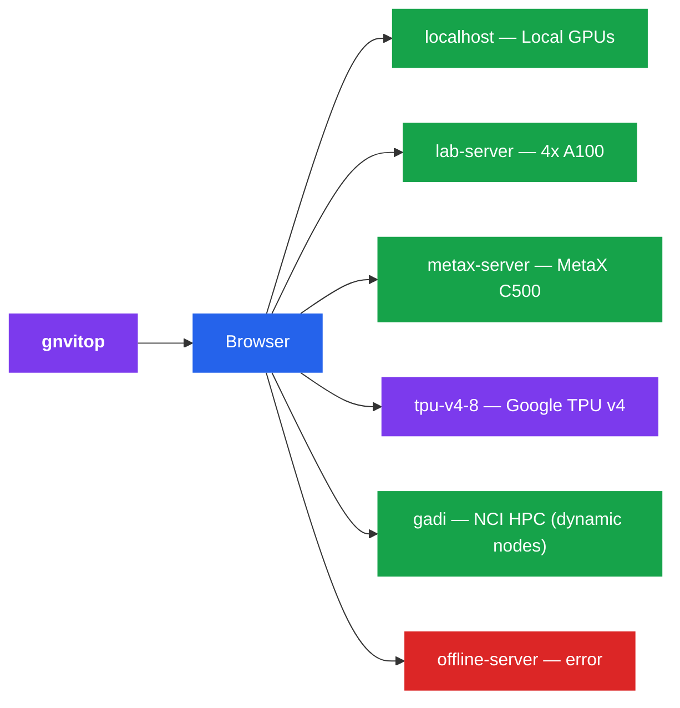

<p align="center">
  
</p>

<h1 align="center">gnvitop</h1>

## This fork: groups, display names, and macOS browser controls

This fork builds on [Linwei94/gnvitop](https://github.com/Linwei94/gnvitop).
It adds persistent server groups and display names, plus a macOS launcher
that lets you start, restart, and stop monitoring from Safari.

- **Organize** lets you create and rename groups, rename server display
  names, and assign servers to groups. SSH connections stay unchanged.
  Empty groups remain visible for future machines.
- Names and assignments are saved in `~/.config/gnvitop/dashboard.json`.
  Set `GNVITOP_PREFERENCES` to override this path.
- Your workloads have a blue accent, highlighted usernames, and per-server
  memory totals. GPU memory bars separate your allocation (blue), other users
  (slate), and system/unreported usage (striped). Matching defaults to each
  server's SSH username; **Organize → My usernames** accepts optional aliases.
- Expand a GPU's process list to see your processes first, with memory and
  sampled SM activity. These per-process readings may overlap and are not an
  additive split of device utilization. Unsupported readings show N/A.
  Process visibility, container usernames, and sampling can limit attribution.
- NVIDIA GPU power appears below memory as watts versus the configured
  power limit, including in compact view. This is whole-GPU power, not per-user
  power or whole-server electricity consumption. Unsupported devices show N/A.
- On macOS, **`gnvitop`** starts monitoring in the background, prints a
  clickable URL, opens Safari, and returns to the shell. Closing the
  terminal does not stop monitoring.
- The dashboard header contains **Refresh · Restart · Stop**. Stop ends
  monitoring and returns to a Start page at the same URL. Save
  `http://127.0.0.1:5050` in Safari Favorites for browser-only use.
- A small local controller starts at login and remains available while
  monitoring is stopped. The last running/stopped state survives controller
  restarts. Both services listen only on the Mac's loopback interface.
- `gnvitop stop`, `gnvitop status`, and `gnvitop restart` are optional
  command equivalents. `gnvitop --no-browser` starts without opening a tab.
  `gnvitop --foreground` retains the original foreground behavior; existing
  options such as `--agent`, `--tui`, and `--version` remain available.
  Other platforms retain the original startup behavior.

Install this fork from a checkout with `pipx install .`, or install a wheel
built from this repository. The upstream PyPI package does not include these
additions. First run installs two per-user launchd jobs; administrator access
is not required. This is a local browser companion, not a Safari extension.

The default inventory remains the SSH configuration. To use a selected list
on macOS, create `~/Library/Application Support/gnvitop/ssh-config` before
the first launch. Existing selected configurations are retained. A RunPod
group does not provision pods or discover them through RunPod's API; add a
reachable SSH entry and assign it to the group.

Polling is shared across browser tabs, initial streams, manual refresh, and
optional history recording. The default remote sampling interval is 30 seconds;
manual refreshes are coalesced with a five-second minimum between completed
cycles. A cycle uses two NVIDIA queries and one process-list snapshot per host.
Unavailable hosts retry with backoff up to five minutes; manual Refresh resets
backoff. Successful hosts update without waiting for slow ones. SSH resources
are closed on failures. Hidden tabs skip visual polling unless notifications are
enabled, and unchanged snapshots are not rendered again.

For development checks: `python -m unittest discover -s tests -v` and
`node tests/test_dashboard.js`.

The original project documentation follows.

<p align="center">
  <strong>Global nvitop</strong> — a web-based GPU &amp; TPU monitoring dashboard that monitors <strong>all</strong> your remote accelerator servers from a single page.
</p>

<p align="center">
  <a href="https://pypi.org/project/gnvitop/"></a>
  <a href="https://pypi.org/project/gnvitop/"></a>
  <a href="https://github.com/Linwei94/gnvitop/blob/main/LICENSE"></a>
</p>


Like [nvitop](https://github.com/XuehaiPan/nvitop), but for **all your servers at once** — NVIDIA GPUs, MetaX GPUs, Google Cloud TPUs, and Gadi NCI compute nodes, displayed as a beautiful web dashboard.

```
pip install gnvitop
gnvitop
```

## How It Works

1. Monitors **local GPU/TPU** automatically (no config needed)
2. Reads your `~/.ssh/config` and SSH into each remote server
3. Auto-detects accelerator type: runs `nvidia-smi` (NVIDIA), `mx-smi` (MetaX), or checks `/dev/accel*` (Google TPU)
4. Displays everything in a real-time web dashboard with **per-user process highlighting**
5. Auto-refreshes every 30 seconds; SSE streaming shows each server as it responds



## Installation

```bash
pip install gnvitop
```

## Usage

```bash
gnvitop                              # start and auto-open browser
gnvitop -p 8080                      # custom port
gnvitop --host 0.0.0.0               # expose to LAN
gnvitop --no-browser                 # don't auto-open browser
gnvitop --ssh-config /path/to/config # custom SSH config
gnvitop --tui                        # terminal UI mode (no browser)
gnvitop --tui --tui-refresh 10       # TUI with 10s refresh interval
gnvitop --agent                      # output JSON for scripting/agents
gnvitop --history --csv out.csv      # record GPU history to CSV
gnvitop -v                           # show version
```

Or run as a module:

```bash
python -m gnvitop
```

## Prerequisites

1. **SSH config** — your `~/.ssh/config` should have server entries:

```
Host gpu-server-01
    HostName 192.168.1.101
    User alice
    IdentityFile ~/.ssh/id_rsa

Host gpu-server-02
    HostName 192.168.1.102
    User bob

# ProxyJump (bastion/jump host) is fully supported
Host compute-node
    HostName compute-node.internal
    User alice
    ProxyJump bastion-host

# Google Cloud TPU VM
Host tpu-v4-8
    HostName <external-ip>
    User <your-user>
    IdentityFile ~/.ssh/google_compute_engine
```

2. **SSH key auth** — password-less login should be set up
3. **Accelerator tools** — `nvidia-smi` (NVIDIA), `mx-smi` (MetaX), or `/dev/accel*` (TPU) on the remote servers

## Features

- **Zero config** — reads `~/.ssh/config` automatically, no setup needed
- **One command** — `pip install gnvitop && gnvitop`, that's it
- **Local + Remote** — monitors local accelerator alongside all remote servers
- **Multi-vendor** — supports NVIDIA GPUs (`nvidia-smi`), MetaX GPUs (`mx-smi`), and Google Cloud TPUs
- **Non-bash shell safe** — wraps remote commands in `bash -c` so it works even if the remote login shell is fish, zsh, etc.
- **TPU support** — detects Google Cloud TPU chips via `/dev/accel*`, shows chip count and HBM spec (v4: 32 GB/chip); utilization shown as N/A until `torch_xla` is installed
- **MetaX support** — parses `mx-smi` output for MetaX C500 and compatible GPUs
- **Gadi NCI support** — SSHes into Gadi login nodes and auto-discovers allocated GPU compute nodes via `qstat`
- **ProxyJump support** — monitors compute nodes behind bastion/jump hosts
- **Per-GPU users** — shows which users occupy each GPU and their memory usage
- **User highlight** — your own processes are highlighted in blue for quick identification
- **Agent mode** — `gnvitop --agent` outputs structured JSON for use in scripts and AI agents
- **History recording** — `gnvitop --history` records GPU stats to CSV for trend analysis
- **TUI mode** — `gnvitop --tui` for a terminal UI without a browser
- **Auto browser** — opens dashboard in your browser on start
- **Adjustable refresh** — choose 5s / 10s / 30s / 5min auto-refresh interval
- **Concurrent** — queries all servers in parallel (20 workers)
- **Fast loading** — background cache warming so the dashboard loads instantly
- **Collapse cards** — fold individual server cards to a compact strip
- **Drag to reorder** — drag server cards to arrange them in any order, persisted across reloads
- **Compact / Normal modes** — toggle between full detail and compact views
- **Dark UI** — clean, responsive dark-themed dashboard
- **At a glance** — summary bar shows online hosts, total GPUs, idle GPUs, free memory
- **Color coded** — green (online), purple (TPU), yellow (no GPU), red (offline), blue (local)

## Agent Mode

`gnvitop --agent` outputs a JSON array suitable for scripting or AI agent use:

```bash
gnvitop --agent
```

```json
[
  {
    "host": "gpu-server-01",
    "status": "ok",
    "gpus": [
      {
        "index": 0,
        "name": "NVIDIA A100-SXM4-80GB",
        "memory_total_mb": 81920,
        "memory_used_mb": 1200,
        "memory_free_mb": 80720,
        "gpu_utilization_pct": 3.0,
        "available": true
      }
    ]
  },
  {
    "host": "tpu-v4-8",
    "status": "ok",
    "gpus": [
      {
        "index": 0,
        "name": "Google TPU v4",
        "memory_total_mb": 32768,
        "memory_used_mb": -1,
        "memory_free_mb": -1,
        "gpu_utilization_pct": -1,
        "available": true
      }
    ]
  }
]
```

For TPU chips, `memory_used_mb` and `gpu_utilization_pct` are `-1` (unknown) until `torch_xla` is installed on the TPU VM. `available` is `true` when no Python processes are detected.

## Comparison with nvitop

| Feature | nvitop | gnvitop |
|---------|--------|---------|
| Monitor local GPU | Yes | Yes |
| Monitor remote GPUs | No | Yes |
| Multiple servers | No | Yes |
| NVIDIA GPU support | Yes | Yes |
| MetaX GPU support | No | Yes |
| Google Cloud TPU support | No | Yes |
| Gadi NCI node discovery | No | Yes |
| Show per-GPU users | Yes | Yes |
| Highlight current user | No | Yes |
| Interface | Terminal | Web browser + Terminal (TUI) |
| Agent/JSON output | No | Yes |
| GPU history (CSV) | No | Yes |
| Setup | Run on each server | Run once, reads SSH config |

**gnvitop** is not a replacement for nvitop — it's a complement. Use nvitop for detailed local process-level GPU monitoring, use gnvitop to get an overview of all your accelerator servers (including local) from one place.

## License

MIT

### Host RAM and storage

Compact RAM and Disk bars sit beside each server name. RAM uses Linux
`MemTotal - MemAvailable`; Disk represents the filesystem containing the SSH
user's home, not the size of their own files or a per-user quota. Hover or focus
Disk for mounted filesystems and capacities; `~` marks the home filesystem.
Shared/bind mounts are deduplicated and temporary/virtual filesystems omitted.

Collection shares the existing SSH command and 30-second cache. RAM reads
`/proc/meminfo`; disk uses two bounded `df` metadata queries, never `du` or file
traversal. Each disk query has a two-second timeout with a one-second kill grace;
unavailable readings show a dash and do not invalidate the GPU sample. Disk
collection requires GNU `df` and `timeout` on Linux; no remote installation or
additional daemon is needed. Only mounted storage is listed; timed-out mounts
may be absent. Local macOS host metrics are currently unavailable.
